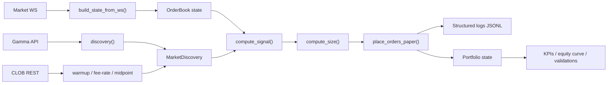
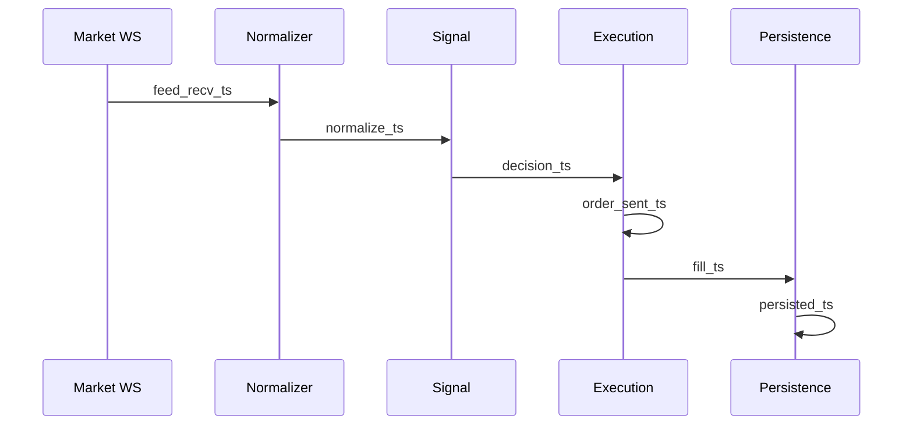

# Polymarket BTC 5m Research Lab

Research layer in Python 3.11 to design and evaluate strategies for `Bitcoin Up/Down` 5 minute markets on Polymarket.

The goal is not to promise profitability. The goal is to measure net expectancy under realistic assumptions:

- fees
- slippage through book depth
- latency budget
- partial or missed fills
- degraded market data

The project uses only official and documented Polymarket surfaces:

- Gamma API: [https://gamma-api.polymarket.com](https://gamma-api.polymarket.com)
- CLOB API: [https://clob.polymarket.com](https://clob.polymarket.com)
- Data API: [https://data-api.polymarket.com](https://data-api.polymarket.com)
- Market WS: `wss://ws-subscriptions-clob.polymarket.com/ws/market`
- User WS: `wss://ws-subscriptions-clob.polymarket.com/ws/user` server-side only
- RTDS: `wss://ws-live-data.polymarket.com` optional

## Files

- [strategy.py](C:/Users/sergi/Desktop/polymarket/polymarket_copy_bot/strategy.py)
- [backtest.py](C:/Users/sergi/Desktop/polymarket/polymarket_copy_bot/backtest.py)
- [paper_runner.py](C:/Users/sergi/Desktop/polymarket/polymarket_copy_bot/paper_runner.py)
- [sample.json](C:/Users/sergi/Desktop/polymarket/polymarket_copy_bot/sample.json)
- [tests/test_fee_model.py](C:/Users/sergi/Desktop/polymarket/polymarket_copy_bot/tests/test_fee_model.py)
- [tests/test_slippage_model.py](C:/Users/sergi/Desktop/polymarket/polymarket_copy_bot/tests/test_slippage_model.py)
- [tests/test_discovery.py](C:/Users/sergi/Desktop/polymarket/polymarket_copy_bot/tests/test_discovery.py)
- [tests/test_backtest_kpis.py](C:/Users/sergi/Desktop/polymarket/polymarket_copy_bot/tests/test_backtest_kpis.py)

## What it implements

- `underround_arb`: double-leg underround arbitrage when `YES + NO < 1 - buffer` after fees, slippage and adverse selection.
- `market_making`: two-sided quote joining on bid-side with inventory control and cancel/replace cadence.
- Replay backtest with realistic paper fill model.
- Walk-forward validation.
- Temporal k-fold validation without leakage.
- Stress tests:
  - slippage x2
  - slippage x3
  - degraded fill probability
  - higher latency
  - websocket dropout
  - fees off
- Live paper runner using market WS plus REST warmup.

## Installation

```bash
python -m venv .venv
.venv\Scripts\activate
pip install -r requirements.txt
```

## Environment variables

By default the whole project runs in paper mode and does not need secrets.

Optional server-side auth variables for future live wiring:

- `POLY_API_KEY`
- `POLY_API_SECRET`
- `POLY_API_PASSPHRASE`

Do not hardcode any key. Do not print any key.

## Config

Configuration lives in dataclasses inside [strategy.py](C:/Users/sergi/Desktop/polymarket/polymarket_copy_bot/strategy.py) and can be overridden with YAML through `ResearchConfig.from_yaml()`.

Important knobs:

- `token_id_yes`, `token_id_no`, `market_condition_id`
- `max_usdc_per_trade`, `max_shares_per_trade`, `edge_to_size_curve`
- `max_inventory_usdc`, `max_daily_loss_usdc`, `kill_switch_drawdown`
- `latency_budget_ms`
- `use_fee_rate_endpoint`, `fee_rate_cache_ttl_s`
- `taker_depth_levels`, `maker_fill_prob_params`, `partial_fill_enabled`
- `slippage_multiplier`, `maker_fill_probability_multiplier`, `taker_fill_ratio`
- `maker_only`, `taker_only`, `hybrid`
- `cancel_replace_interval_ms`
- `max_rps_gamma`, `max_rps_data`, `max_rps_clob`
- `data_dir`, `event_log_format`

## Replay fixture

[sample.json](C:/Users/sergi/Desktop/polymarket/polymarket_copy_bot/sample.json) contains a minimal reproducible multi-window replay.

Excerpt:

```json
{
  "meta": {
    "token_yes": "TOKEN_YES",
    "token_no": "TOKEN_NO",
    "fees_enabled": true,
    "fee_rate_bps": 15.6
  },
  "events": [
    {
      "ts_ms": 1710500000000,
      "event": "book",
      "token_id": "TOKEN_YES",
      "bids": [[0.49, 1200.0], [0.48, 3500.0]],
      "asks": [[0.51, 900.0], [0.52, 2800.0]],
      "extra": {"tick_size": 0.001}
    }
  ]
}
```

## Commands

Replay backtest:

```bash
python backtest.py --input sample.json
```

Replay with validations and stress:

```bash
python backtest.py --input sample.json --walk-forward --temporal-kfold --stress
```

Paper runner:

```bash
python paper_runner.py
```

Short smoke:

```bash
python paper_runner.py --max-seconds 30
```

Market discovery:

```bash
python strategy.py --discover
```

Tests:

```bash
python -m pytest
```

## Outputs

Baseline replay exports:

- `data/research/backtest/kpis.csv`
- `data/research/backtest/equity_curve.csv`
- `data/research/backtest/backtest_log.jsonl`

Walk-forward exports:

- `data/research/backtest/walk_forward/walk_forward_folds.csv`
- `data/research/backtest/walk_forward/walk_forward_summary.csv`

Temporal k-fold exports:

- `data/research/backtest/temporal_kfold/temporal_kfold_folds.csv`
- `data/research/backtest/temporal_kfold/temporal_kfold_summary.csv`

Stress exports:

- `data/research/backtest/stress/stress_summary.csv`
- one subdirectory per scenario with KPIs, equity curve and structured logs

## KPIs

The backtest computes:

- net expectancy per trade
- net expectancy per window
- annualized Sharpe
- annualized Sortino
- hit rate
- max drawdown
- time to recover
- fill rate
- cancel rate
- slippage in USDC and bps
- end-to-end latency
- average spread
- average top-3 depth

Example KPI table:

| KPI | Example |
|---|---:|
| expectancy_trade_usdc | -0.39 |
| expectancy_window_usdc | -1.26 |
| fill_rate | 1.00 |
| cancel_rate | 0.00 |
| avg_slippage_bps | 0.00 |
| max_drawdown_usdc | 6.30 |

Negative example results are acceptable during research. They are useful because they show the framework is measuring edge instead of inventing it.

## Architecture



## Pipeline timeline



## Security

- Never hardcode API keys or signing keys.
- Read secrets only from environment variables.
- Keep the user WS private and server-side only.
- Do not scrape the Polymarket web UI.
- Keep paper mode as default.
- If data quality degrades, prefer no-trade over guessing.

## Production notes

If this research layer evolves into a production service:

- split discovery, market data, execution and persistence into separate workers
- persist events, decisions and fills in Postgres plus object storage
- track observability for:
  - latency
  - fill rate
  - slippage
  - data degradation
  - drawdown
- use CI for pytest, replay smoke tests and packaging checks
- keep live trading behind explicit feature flags and secret management

## Limitations

- The live paper runner is still a simulation.
- `place_orders_live()` is intentionally blocked until proper authenticated wiring is added.
- The market making model is for research, not production market making.
- The replay fixture is small and only intended as a deterministic smoke dataset.
- Real profitability still requires larger datasets, better calibration and strict out-of-sample testing.
