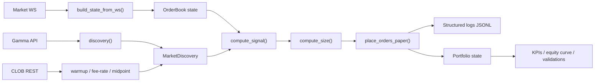
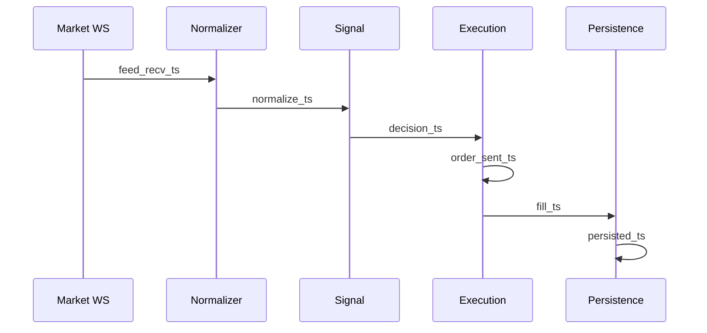

# Polysainz Sports Desk

Read-only sports market observatory for Polymarket. The public deployment discovers sports
events through public Gamma data, reads public market prices, shows public sports-feed updates,
and keeps paper hypotheses in local browser storage.

The BTC5m runtime is archived. Its code and historical data remain recoverable from Git history,
but it is not part of the public web bundle and must not be enabled through this project.

The goal is not to promise profitability. The goal is to measure net expectancy under realistic assumptions:

- fees
- slippage through book depth
- latency budget
- partial or missed fills
- degraded market data

The observer uses only public and documented Polymarket surfaces:

- Gamma API: [https://gamma-api.polymarket.com](https://gamma-api.polymarket.com)
- CLOB API: [https://clob.polymarket.com](https://clob.polymarket.com)
- Data API: [https://data-api.polymarket.com](https://data-api.polymarket.com)
- Market WS: `wss://ws-subscriptions-clob.polymarket.com/ws/market`
- User WS: `wss://ws-subscriptions-clob.polymarket.com/ws/user` server-side only
- RTDS: `wss://ws-live-data.polymarket.com` optional

## Files

- [strategy.py](C:/Users/sergi/Desktop/polymarket/polymarket_copy_bot/strategy.py)
- [backtest.py](C:/Users/sergi/Desktop/polymarket/polymarket_copy_bot/backtest.py)
- [paper_runner.py](C:/Users/sergi/Desktop/polymarket/polymarket_copy_bot/paper_runner.py)
- [sample.json](C:/Users/sergi/Desktop/polymarket/polymarket_copy_bot/sample.json)
- [tests/test_fee_model.py](C:/Users/sergi/Desktop/polymarket/polymarket_copy_bot/tests/test_fee_model.py)
- [tests/test_slippage_model.py](C:/Users/sergi/Desktop/polymarket/polymarket_copy_bot/tests/test_slippage_model.py)
- [tests/test_discovery.py](C:/Users/sergi/Desktop/polymarket/polymarket_copy_bot/tests/test_discovery.py)
- [tests/test_backtest_kpis.py](C:/Users/sergi/Desktop/polymarket/polymarket_copy_bot/tests/test_backtest_kpis.py)

## What the public observer implements

- Sports league and event discovery through Gamma.
- Market type, price, spread, visible liquidity, minimum size, fee metadata and resolution source.
- Public sports WebSocket scoreboard updates with stale-state handling.
- Search and league/market filters.
- Local paper notebook clearly labelled as simulation.
- Strictly no wallet, private key, authenticated CLOB client or order route in the web bundle.

The public observer does not place, sign, cancel or arm orders. Existing Polymarket credentials remain
server-side and are not required for this read-only surface.

## Daily advisor (safe foundation)

The separate `app/advisor/` package is the first foundation for a daily opportunity workflow. It:

- abstains unless an independently sourced, calibrated probability interval is supplied;
- prices proposals using executable quote, fees, slippage, liquidity and a conservative probability bound;
- persists an immutable proposal and one-time confirmation code without storing the code in SQLite;
- validates a signed, allowlisted WhatsApp reply against the exact outbound message ID;
- claims execution once, revalidates the quote, reserves the daily loss budget atomically and keeps ambiguous
  provider responses for reconciliation.

The risk ledger uses UTC calendar days: open reservations remain counted across midnight, while a realized loss is
settled into the UTC day in which it is observed. A reconciliation operator must resolve ambiguous provider results
through the explicit store reconciliation operation before releasing or settling a reservation; keys are server-side
and should be rotated through deployment secrets.
An order reported as `cancelled` is not treated as a zero-fill result: it remains reserved until reconciliation
confirms `filled_size=0` or identifies an order/fill to settle.

It does not discover sports markets, invent probability estimates, send WhatsApp messages or place orders by
default. `ADVISOR_ENABLED=false`, `ADVISOR_LIVE_ENABLED=false`, `ADVISOR_BROKER_CONFIGURED=false`,
`LIVE_TRADING=false`, paper mode and dry-run remain the required baseline. Do not set the live flags until the
model has out-of-sample calibration evidence, the WhatsApp channel is legally and operationally eligible, and the
CLOB client has been audited for the current Polymarket API version.

The optional `SportsMarketDiscovery` adapter uses the public Gamma market list and public CLOB order books, while
`DailyAdvisorRunner` connects it to a supplied independent probability model and the durable WhatsApp outbox.
`DailyAdvisorScheduler` runs at most once per UTC day. The probability model is intentionally an explicit dependency:
the system will not infer probability from the market price or fabricate sports predictions. `PolymarketCLOBSubmitter`
is an explicit, fail-closed adapter for the existing authenticated client; ambiguous responses remain pending for
reconciliation and are never retried automatically.

`JsonProbabilityModel` is the safe default adapter. Set `ADVISOR_EVIDENCE_PATH` to a server-side JSON artifact with
`predictions` keyed by the exact `market_id`, `condition_id`, `token_id` and `outcome`, plus `probability`,
`lower_probability`, `upper_probability`, `model_name`, `model_version`, `calibrated`, `sample_size`, `brier_score`,
`as_of`, `source_refs` and `independent`. It does not train or forecast; missing, duplicated, stale or uncalibrated
records produce no trade proposal. The artifact must be generated and validated out of band from real sports data.

The public Vercel site must not receive these server-side keys. The advisor database and webhook belong on the
private NAS or another authenticated backend, not in the static browser bundle.

The server-side entrypoint is `polymarket-advisor`. It loads `.env`, keeps the SQLite ledger on the NAS, and never
prints confirmation codes or secrets:

```bash
polymarket-advisor status
polymarket-advisor daily
polymarket-advisor scheduler
polymarket-advisor webhook --host 127.0.0.1 --port 8787
```

`daily` and `scheduler` require `ADVISOR_BANKROLL_USDC > 0`. They only create proposals when the independent
evidence artifact passes all gates. The webhook is a separate private process; expose it through an authenticated
reverse proxy and do not publish the SQLite file or WhatsApp secrets to Vercel. The live execution worker is not
started by this CLI and remains behind the explicit live gates plus manual confirmation.

## Research layer retained for later paper work

- `underround_arb`: double-leg underround arbitrage when `YES + NO < 1 - buffer` after fees, slippage and adverse selection.
- `market_making`: two-sided quote joining on bid-side with inventory control and cancel/replace cadence.
- Replay backtest with realistic paper fill model.
- Walk-forward validation.
- Temporal k-fold validation without leakage.
- Stress tests:
  - slippage x2
  - slippage x3
  - degraded fill probability
  - higher latency
  - websocket dropout
  - fees off
- Live paper runner using market WS plus REST warmup.

## Installation

```bash
python -m venv .venv
.venv\Scripts\activate
pip install -r requirements.txt
```

## Environment variables

By default the whole project runs in paper mode and does not need secrets.

Optional server-side auth variables for future live wiring:

- `POLY_API_KEY`
- `POLY_API_SECRET`
- `POLY_API_PASSPHRASE`

Do not hardcode any key. Do not print any key.

## Config

Configuration lives in dataclasses inside [strategy.py](C:/Users/sergi/Desktop/polymarket/polymarket_copy_bot/strategy.py) and can be overridden with YAML through `ResearchConfig.from_yaml()`.

Important knobs:

- `token_id_yes`, `token_id_no`, `market_condition_id`
- `max_usdc_per_trade`, `max_shares_per_trade`, `edge_to_size_curve`
- `max_inventory_usdc`, `max_daily_loss_usdc`, `kill_switch_drawdown`
- `latency_budget_ms`
- `use_fee_rate_endpoint`, `fee_rate_cache_ttl_s`
- `taker_depth_levels`, `maker_fill_prob_params`, `partial_fill_enabled`
- `slippage_multiplier`, `maker_fill_probability_multiplier`, `taker_fill_ratio`
- `maker_only`, `taker_only`, `hybrid`
- `cancel_replace_interval_ms`
- `max_rps_gamma`, `max_rps_data`, `max_rps_clob`
- `data_dir`, `event_log_format`

## Replay fixture

[sample.json](C:/Users/sergi/Desktop/polymarket/polymarket_copy_bot/sample.json) contains a minimal reproducible multi-window replay.

Excerpt:

```json
{
  "meta": {
    "token_yes": "TOKEN_YES",
    "token_no": "TOKEN_NO",
    "fees_enabled": true,
    "fee_rate_bps": 15.6
  },
  "events": [
    {
      "ts_ms": 1710500000000,
      "event": "book",
      "token_id": "TOKEN_YES",
      "bids": [[0.49, 1200.0], [0.48, 3500.0]],
      "asks": [[0.51, 900.0], [0.52, 2800.0]],
      "extra": {"tick_size": 0.001}
    }
  ]
}
```

## Commands

Replay backtest:

```bash
python backtest.py --input sample.json
```

Replay with validations and stress:

```bash
python backtest.py --input sample.json --walk-forward --temporal-kfold --stress
```

Paper runner:

```bash
python paper_runner.py
```

Short smoke:

```bash
python paper_runner.py --max-seconds 30
```

Market discovery:

```bash
python strategy.py --discover
```

Tests:

```bash
python -m pytest
```

## Outputs

Baseline replay exports:

- `data/research/backtest/kpis.csv`
- `data/research/backtest/equity_curve.csv`
- `data/research/backtest/backtest_log.jsonl`

Walk-forward exports:

- `data/research/backtest/walk_forward/walk_forward_folds.csv`
- `data/research/backtest/walk_forward/walk_forward_summary.csv`

Temporal k-fold exports:

- `data/research/backtest/temporal_kfold/temporal_kfold_folds.csv`
- `data/research/backtest/temporal_kfold/temporal_kfold_summary.csv`

Stress exports:

- `data/research/backtest/stress/stress_summary.csv`
- one subdirectory per scenario with KPIs, equity curve and structured logs

## KPIs

The backtest computes:

- net expectancy per trade
- net expectancy per window
- annualized Sharpe
- annualized Sortino
- hit rate
- max drawdown
- time to recover
- fill rate
- cancel rate
- slippage in USDC and bps
- end-to-end latency
- average spread
- average top-3 depth

Example KPI table:

| KPI | Example |
|---|---:|
| expectancy_trade_usdc | -0.39 |
| expectancy_window_usdc | -1.26 |
| fill_rate | 1.00 |
| cancel_rate | 0.00 |
| avg_slippage_bps | 0.00 |
| max_drawdown_usdc | 6.30 |

Negative example results are acceptable during research. They are useful because they show the framework is measuring edge instead of inventing it.

## Architecture


```mermaid
flowchart LR
  A["Gamma API"] --> D["discovery()"]
  B["CLOB REST"] --> E["warmup / fee-rate / midpoint"]
  C["Market WS"] --> F["build_state_from_ws()"]
  F --> G["OrderBook state"]
  D --> H["MarketDiscovery"]
  E --> H
  G --> I["compute_signal()"]
  H --> I
  I --> J["compute_size()"]
  J --> K["place_orders_paper()"]
  K --> L["Structured logs JSONL"]
  K --> M["Portfolio state"]
  M --> N["KPIs / equity curve / validations"]
```

## Pipeline timeline


```mermaid
sequenceDiagram
  participant WS as Market WS
  participant N as Normalizer
  participant S as Signal
  participant X as Execution
  participant P as Persistence
  WS->>N: feed_recv_ts
  N->>S: normalize_ts
  S->>X: decision_ts
  X->>X: order_sent_ts
  X->>P: fill_ts
  P->>P: persisted_ts
```

## Security

- Never hardcode API keys or signing keys.
- Read secrets only from environment variables.
- Keep the user WS private and server-side only.
- Do not scrape the Polymarket web UI.
- Keep paper mode as default.
- If data quality degrades, prefer no-trade over guessing.

## Production notes

If this research layer evolves into a production service:

- split discovery, market data, execution and persistence into separate workers
- persist events, decisions and fills in Postgres plus object storage
- track observability for:
  - latency
  - fill rate
  - slippage
  - data degradation
  - drawdown
- use CI for pytest, replay smoke tests and packaging checks
- keep live trading behind explicit feature flags and secret management

## Archived BTC5m deployment

The previous BTC5m live dashboard and systemd units are retained only for historical recovery.
Do not start `polymarket-live.service` or `polymarket-dashboard-live.service` while evaluating
the sports observer. See [archive/btc5m/README.md](C:/Users/sergi/Desktop/polymarket/polymarket_copy_bot/archive/btc5m/README.md).

The BTC5m runtime was last referenced at commit `eb21efc`.

## Limitations

- The live paper runner is still a simulation.
- `place_orders_live()` is intentionally blocked until proper authenticated wiring is added.
- The market making model is for research, not production market making.
- The replay fixture is small and only intended as a deterministic smoke dataset.
- Real profitability still requires larger datasets, better calibration and strict out-of-sample testing.
